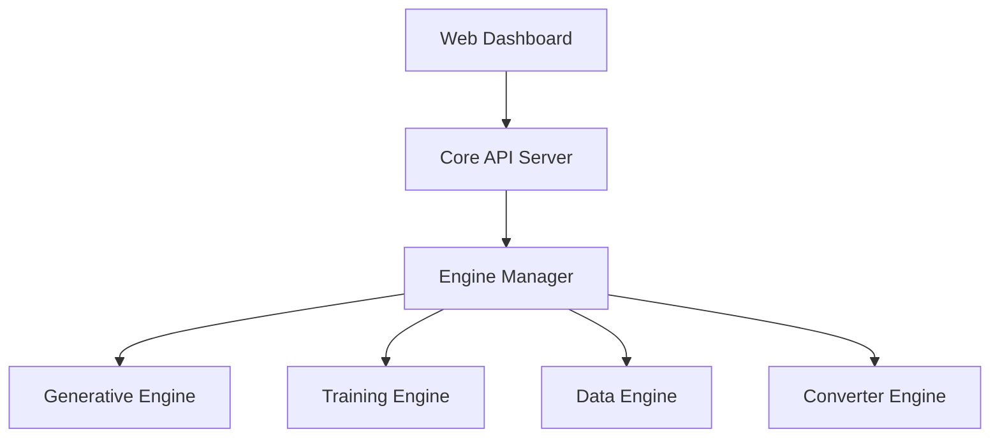

# MLX AI Studio
**The Universal AI Platform for Apple Silicon (Expected initial test release in Q2-Q3 2026)**

**MLX AI Studio** is a unified, high-performance AI platform designed specifically for Apple Silicon products running MacOS. It consolidates a custom MLX integrated vLLM Inference Engine, Dataset Creation, Fine-Tuning with Q/LoRa and Universal Model Conversion into a single, cohesive application powered natively by Apple's Metal framework.

This project is optimized for the **M3 Ultra & M4 Max** product ranges with 128GB+ memory. Though 256Gb and 512Gb models are highly recommended.
It will still work on other Apple Silicon Macs/Macbooks/Minis. But functionality and performance will differ dramatically depending on the model, the task and the amount of memory available.

## Features

### Inference Studio
High-throughput serving for all your models.
- **LLM & VLM:** Run Llama 4, Qwen 3, Mistral AI, GLM-4, MiniMax and more with continuous batching, and PagedAttention.
- **Image Generation:** Native Flux and Stable Diffusion XL pipelines.
- **Video Generation:** Native Wan2.2, LTX-2 and HunyuanVideo coming later.
- **Audio:** Text-to-Speech (Kokoro), Music Generation (MusicGen), and Speech-to-Text (Whisper).

### Training Studio
Fine-tune models locally on your Mac.
- **Native MLX Training:** SFT, DPO, ORPO, and GRPO methods.
- **Efficient:** Optimised for Unified Memory, allowing 70B+ model fine-tuning on 128GB Macs.
- **Visual Dashboard:** Monitor loss curves and hyperparameters in real-time.

### Data Studio
The complete data lifecycle manager.
- **Extraction:** Extract text from your PDFs and raw text files. Also other sources...
- **Synthesis:** Generate high quality multi-turn Q&A datasets from raw seeds using a "Teacher" model.
- **Processing:** Semantic chunking, deduplication, and personal ID information (PII) redaction.

### Universal Converter
The all-in-one converter for model formats.
- **Any-to-Any:** Convert PyTorch `.bin`, `.safetensors` to GGUF (for lamma.cpp / Ollama), MLX (Native), or CoreML (Neural Engine).
- **Auto Fix:** Automatically sanitises tensor dictionaries.

### Community Hub (Basic at first)
Global online model and dataset registry (Client-Server).
- **Global Registry:** Browse, search, and download models and datasets from the Community Hub.
- **Push to Hub:** Version and share your fine-tuned models and datasets.
- **Marketplace & Licensing:** Monetise your work! Buy, sell, or license proprietary high quality datasets and pre trained models.
    - Supports custom licensing, MIT/Apache2.0, GPL3, Commercial, Research Only, Non-commercial and custom licensing etc.).
    - Unified wallet/payment system for instant access to paid assets.
- **Authentication:** Integrated user and profile management, license management and resource governance.

---

## Architecture

MLX AI Studio utilises a **Hub & Spoke** architecture controlled by a central `EngineManager`. This ensures stability on Unified Memory systems by dynamically loading and unloading heavy engines (Training vs Inference) to prevent Out-Of-Memory (OOM) crashes.

---

## Usage

- **Dashboard:** View system health and memory usage.
- **Playground:** Chat with models and generate media.
- **Train:** Configure and start fine-tuning jobs.
- **Data:** Manage your datasets and synthesis pipelines.

---

## Contributing

We welcome contributions! However, please note that we will operate under a **Private-First Development Model**.

**To maintain high code quality and security, the source code for this project is hosted in a private repository.** This public repository strictly contains **Documentation**, **Installer Scripts**, **Binaries**, and the **Release Issue Tracker**.

**Direct code contributions to this repository are restricted.** Please see [CONTRIBUTING.md](CONTRIBUTING.md) for details on how to join the development team.

## License

This project is licensed under the Apache 2.0 License - see the [LICENSE](LICENSE) file for details.

---

## Acknowledgments

While we have created a custom engine, this project is built upon or inspired by the tireless effort of others. We explicitly acknowledge and credit the following projects for their open-source contributions, which are used in compliance with their respective Apache 2.0 / MIT licenses:

- **[MLX](https://github.com/ml-explore/mlx)** by Apple: The foundation of our Metal backend.
- **[vLLM](https://github.com/vllm-project/vllm)**: Portions of the PagedAttention logic and block management are adapted from vLLM.
- **[Unsloth](https://github.com/unslothai/unsloth)**: Training kernels and LoRA implementation details are inspired by Unsloth.
- **[Augmentoolkit](https://github.com/e-p-armstrong/augmentoolkit)**: The synthetic data generation pipeline is based on Augmentoolkit.
- **[MLX Examples](https://github.com/ml-explore/mlx-examples)**: Reference implementations for various model architectures.
- **[Gradio](https://github.com/gradio-app/gradio)**: The UI framework.

> We would like to extend a special thanks to **[waybarrios/vllm-mlx](https://github.com/waybarrios/vllm-mlx)** for providing the initial template and inspiration for our custom MLX integration into the vLLM system.

---
